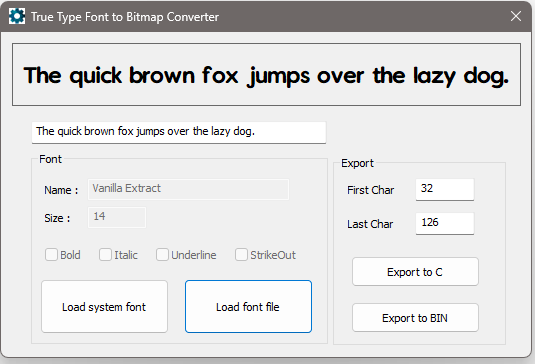

# TrueType Font Converter for Embedded Systems  
This utility converts TrueType fonts for use in embedded systems, such as Arduino and others.

  

## Author
Developed by Dad Design.

## Features  
- **Export Formats:**  
  - **C header file (.h):** For direct inclusion in application code.  
  - **Binary file:** For loading into application flash memory.  

Simplify font management in your embedded projects with ease!  

## License
This project is licensed under the MIT License.
